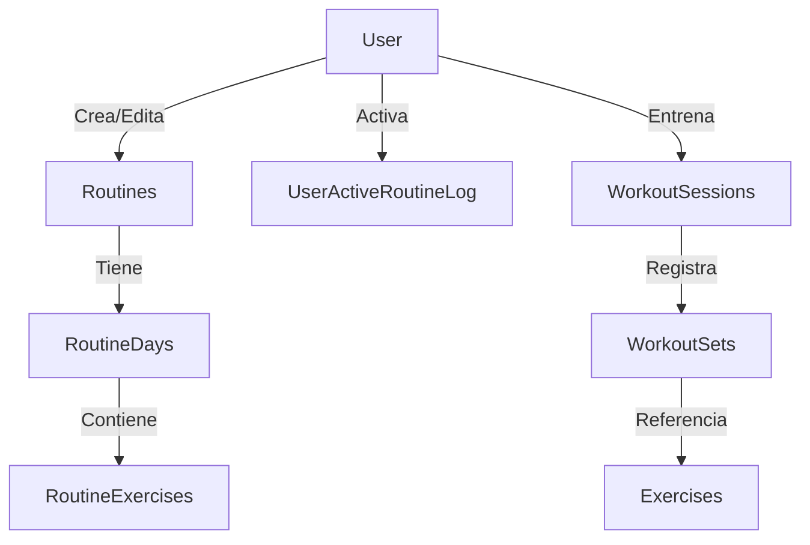
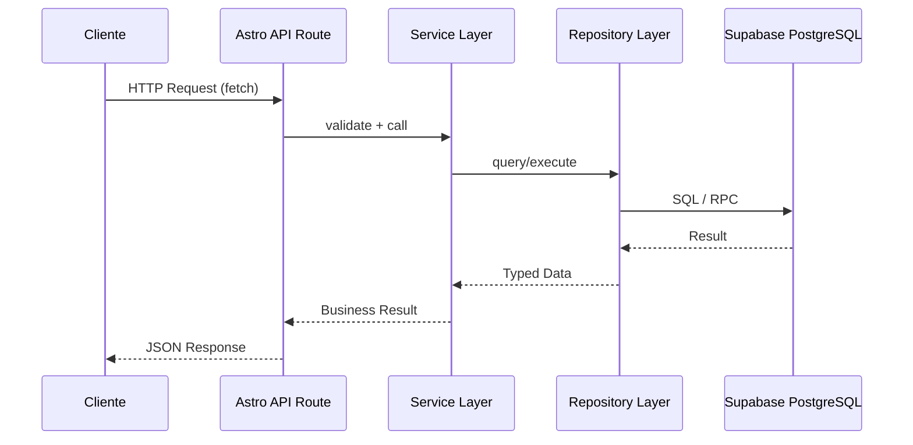

# IRON TRACK - Architecture Overview

## Data Flow Diagram

## Request Flow Through Layers

## Main Modules

The application is organized into 7 core modules:

1. **Auth**: User authentication, registration, session management, and role-based access control (user vs admin).
2. **Exercises**: Exercise catalog management. Users can suggest exercises; admins approve them. Supports image uploads.
3. **Routines**: Workout routine builder. Users create routines, add days, and assign exercises with suggested sets/reps. Supports public sharing and activation.
4. **Workouts**: Live workout tracking. Users start a session based on a routine day, log sets, reps, and weight, and mark sessions as completed.
5. **Calendar/History**: Past workout visualization. Users review previous sessions, track consistency, and analyze progress over time.
6. **Community**: Social features. Users can discover public routines, like them, and view leaderboards or shared progress.
7. **Landing**: Marketing and informational pages. Static content, SEO-optimized, with calls to action.

## Module Dependencies

The recommended implementation order respects these dependencies:

- **Auth** must be implemented first, as almost every other module requires a `userId`.
- **Exercises** comes next, because routines and workouts reference exercises.
- **Routines** depends on Auth and Exercises.
- **Workouts** depends on Auth and Routines (optionally Exercises for free-form workouts).
- **Calendar/History** depends on Workouts.
- **Community** depends on Routines and Auth.
- **Landing** is independent and can be built in parallel.

## Layer Responsibilities

- **Controllers (Astro API Routes)**: Handle HTTP requests, parse and validate input, extract cookies/headers, call the appropriate Service, and return JSON responses. They must NEVER contain business logic or direct database calls.
- **Services**: Contain all business logic, orchestration, and validation rules. Services call Repositories to fetch or persist data and transform raw data into business results. They are the gatekeepers of the domain rules.
- **Repositories**: Abstract all data access logic. They communicate directly with Supabase (PostgreSQL) via SQL, RPC, or the Supabase client. They return typed data (using Models) and handle query construction.
- **Models**: Pure TypeScript interfaces that define the shape of the data flowing through the system. They are shared across layers to ensure type safety.

## Architecture Rules

- **NO Server Actions**: All mutations (creates, updates, deletes) must go through Astro API Routes (`src/pages/api/*`). This keeps the boundary between client and server explicit and testable.
- **Server Islands are ONLY for static presentation/reading**: Astro Server Islands can be used to render static or read-only data on the server, but they must not perform mutations. Any state change requires a client-side fetch to an API Route.
